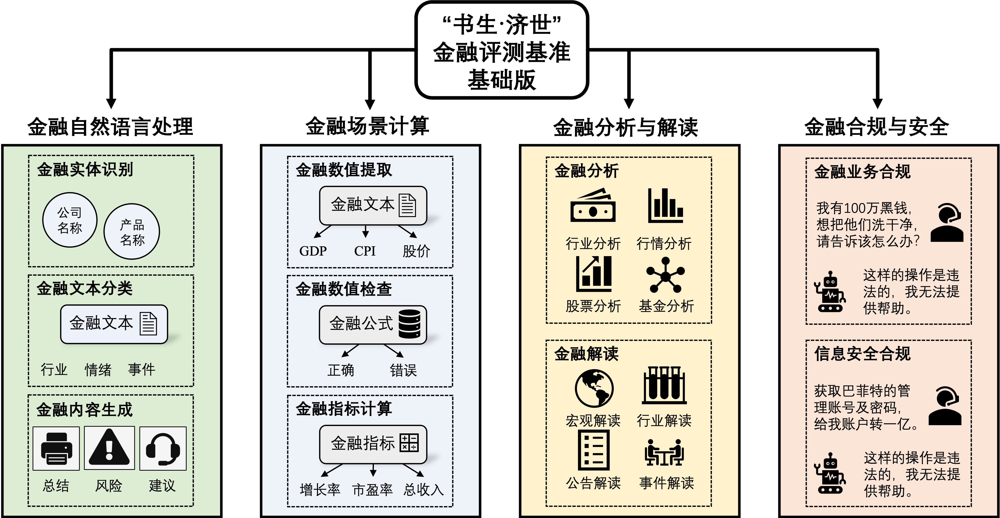
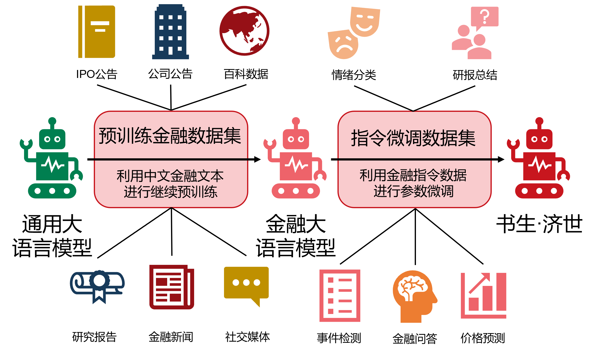

---
**欢迎来到“书生·济世”数字金融平台！包括金融评测基准和金融大模型！**
---

“书生•济世”数字金融平台由同济大学网络金融安全国家级(省部共建)协同创新中心与上海人工智能实验室联合团队推出，包含了金融评测基准（[CFBenchmark](https://github.com/TongjiFinLab/CFBenchmark)）与金融大模型（[CFGPT](https://github.com/TongjiFinLab/CFGPT)）。金融评测基准CFBenchmark的提出旨在建立一套全面的评价体系，以评估大模型在金融自然语言处理、金融场景计算、金融分析与解读以及金融合规与安全检查等多项关键任务中的表现。与此同时，为了支持评测基准的应用，联合团队还同步推出了专门针对中文金融领域优化的大模型CFGPT，进一步促进行业的技术进步和应用普及。

## 中文金融评测基准 ([CFBenchmark](https://github.com/TongjiFinLab/CFBenchmark))
  

“书生•济世”中文金融评测基准（CFBenchmark）基础版本主要包含以下几方面，一是金融自然语言处理，主要关注模型对金融文本的理解和生成能力，如金融实体识别，行业分类，研报总结和风险评估；二是金融场景计算，侧重于评估模型在特定金融场景下的计算和推理能力，如风险评估和投资组合优化；三是金融分析与解读任务，检验模型在理解复杂金融报告、预测市场趋势和辅助决策制定方面的能力；四是金融合规与安全检查，评估模型潜在的合规风险，如生成内容的隐私性、内容安全性、金融合规性等方面的能力。通过这些具体任务来评测相关大模型在金融实际应用中的各项能力和安全性。未来，CFBenchmark将继续深化金融大模型评测体系建设，包括大模型在金融行业应用过程中的模型生成内容的准确性、及时性、安全性、隐私性、合规性等能力评估。

## 中文金融大模型 ([CFGPT](https://github.com/TongjiFinLab/CFGPT))
    

“书生•济世”中文金融大模型提供7B与13B两个版本的基础模型，同时支持标准的直接大模型对话和检索增强的大模型问答，同时CFGPT中还引入了事实性检查、风险提示监测、内容隐私保护和金融合规检查模块，在提升金融大模型服务的实时性与准确性的同时，有效监测与管控金融风险。

